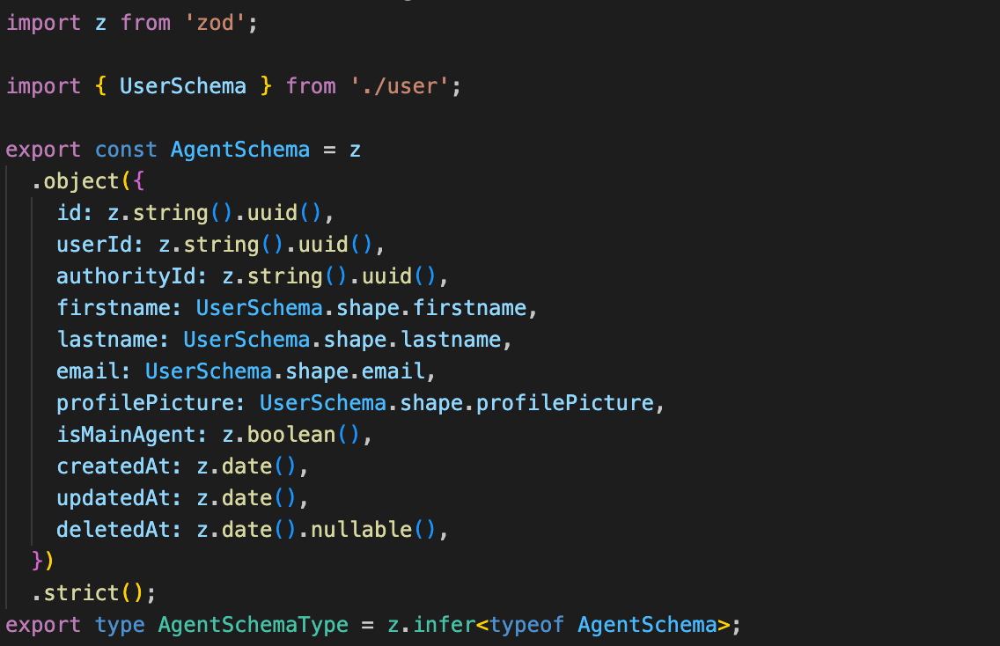
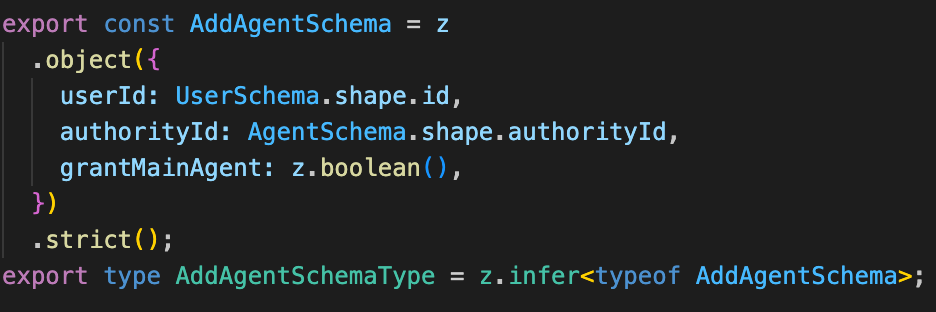

# Validation des données entrantes

Que ce soit sur vos endpoints tRPC ou sur un endpoint à part dans Next.js pour recevoir des [_webhooks_](https://en.wikipedia.org/wiki/Webhook), la devise est de **toujours valider les données entrantes**.

Nous utilisons [_zod_](https://github.com/colinhacks/zod) pour faire la validation au moment du runtime (quand les types ne peuvent être garantis sur les données entrantes). Cela nous permet une certaine flexibilité puisqu'il peut servir à la validation d'entrée d'un endpoint mais aussi pour formater une structure métier (dans le cas où vous voulez que ça émette une erreur si la structure récupérée depuis une base de données est mal formatée par exemple).

- Une pratique peut être de définir vos structures métiers avec zod puisque les types peuvent être “[_inférés_](https://en.wikipedia.org/wiki/Type_inference)” ;
- zod est nativement supporté par tRPC, donc vous n'avez qu'à mettre votre structure “input” au niveau du endpoint ;
- zod peut s'utiliser côté frontend avec [_react-hook-form_](https://github.com/react-hook-form/react-hook-form) afin de faire des validations sans même contacter le serveur. Ce qui est pratique dans notre cas c'est que la même structure de validation est utilisée dans les 2 mondes (avec ces textes d'erreurs qui peuvent être personnalisés).

