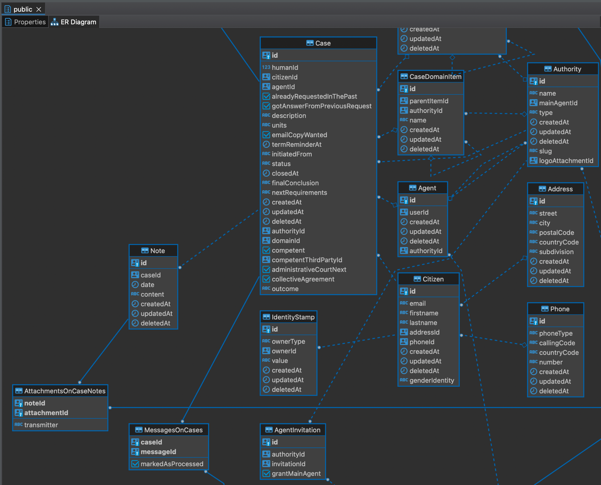

# Le schéma de base de données

Nous privilégions l'utilisation d'un ORM pour représenter notre schéma de base de données, comme cela tout comme le code, le schéma est versionné.

Vous aurez plus loin [_le chapitre base de données_](#une-base-de-données-qui-fait-tout-vraiment) (on utilise une base relationnelle), mais sachez qu'en utilisant un outil comme [_DBeaver_](https://dbeaver.io) vous êtes en mesure de générer un diagramme représentant votre schéma de données (et donc vous êtes sûrs qu'il est synchronisé avec la réalité). Pour cela via l'outil, connectez-vous à votre base de données, puis, dans l'arborescence clic droit sur votre base et _“Voir le diagramme”_.

Diagramme d'un schéma de base de données dans DBeaver

_Comme celui-ci découle des relations déclarées par l'ORM dans votre code, il n'y a pas besoin de l'exporter pour le committer._
