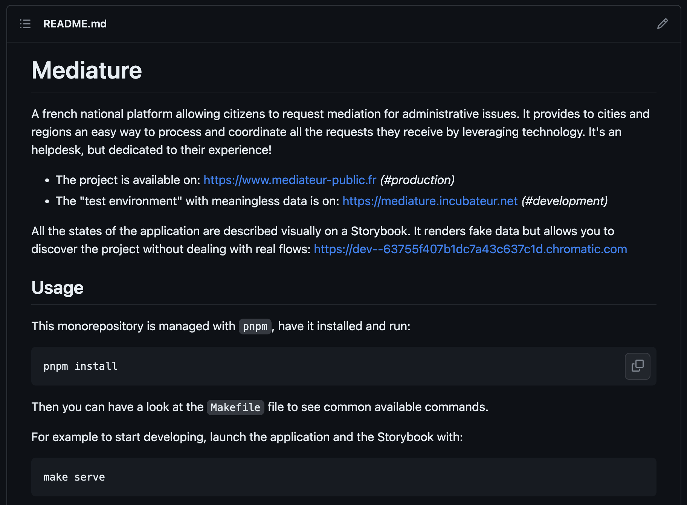

# La macro-technique

Il est déconseillé de documenter votre projet technique en dehors de votre repository Git. Le simple fait de mettre une distance entre votre code et sa propre documentation fait qu'avec le temps ils seront désynchronisés. Utilisez plutôt des fichiers Markdown qui permettent un formatage assez poussé, tout en bénéficiant du versionning de Git.

Dans un _README.md_ mettez :

1.  Une courte description du projet ;
2.  Les étapes pour lancer votre projet localement (utile pour l'autonomie des personnes) ;
3.  Les étapes pour configurer tous les outils nécessaires à l'environnement de production (ceux qui ne peuvent pas être configurés via du code) ;
4.  Quelques informations sur les bonnes pratiques à respecter pour contribuer au repository.

Exemple d'un _README.md_ [_(source)_](https://github.com/inclusion-numerique/mediature/tree/dev)

Sachez que si vous souhaitez faire des schémas de votre architecture (en [_UML_](<https://fr.wikipedia.org/wiki/UML_(informatique)>) ou pseudo-UML), l'idéal c'est aussi de les versionner. En plus vous pouvez utiliser l'outil [_draw.io directement dans l'éditeur de code Visual Studio Code_](https://marketplace.visualstudio.com/items?itemName=hediet.vscode-drawio), tout se fait au même endroit, c'est hyper pratique.

Exemple d'un schéma intégré à un README [_(source)_](https://github.com/inclusion-numerique/mediature/blob/dev/TECHNICAL_ARCHITECTURE_DOCUMENT.md#services-diagram)

_Si vous préférez définir vos schémas via du code plutôt qu'une UI, allez voir l'outil [Mermaid](https://github.com/mermaid-js/mermaid)._
